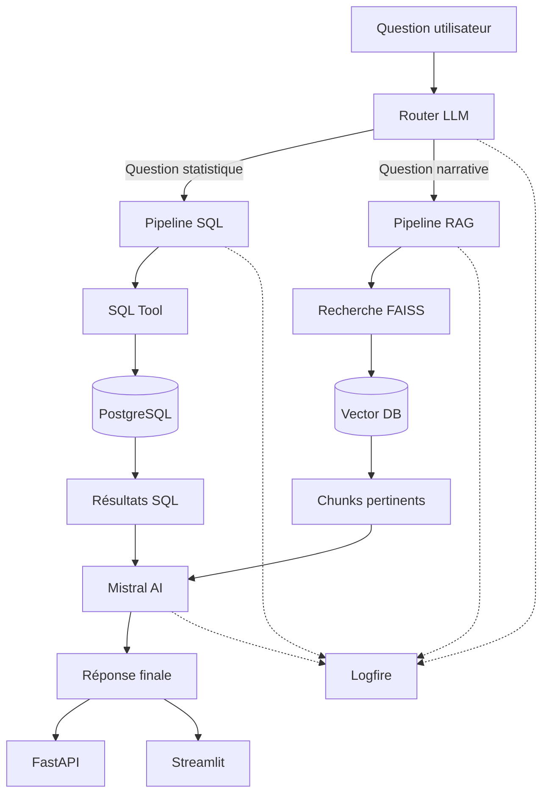

# 🏀 RAG-SQL-NBA — Assistant NBA avec Mistral AI

[](https://www.python.org/)
[](https://mistral.ai/)
[](https://fastapi.tiangolo.com/)
[](https://streamlit.io/)
[](https://github.com/facebookresearch/faiss)
[](https://www.postgresql.org/)
[](https://docs.ragas.io/)
[](https://logfire.pydantic.dev/)

## 📌 Présentation

**RAG-SQL-NBA** est un assistant intelligent basé sur **Mistral AI**, conçu pour explorer et analyser les performances des joueurs et des équipes NBA.

Le système combine deux approches complémentaires :

* 🔎 **RAG (Retrieval-Augmented Generation)** avec recherche vectorielle et FAISS pour exploiter les informations textuelles et narratives.
* 🗄️ **SQL** avec PostgreSQL pour interroger les données statistiques structurées.
* 🧠 **Router LLM** permettant d'orienter automatiquement chaque question vers le pipeline RAG ou SQL.
* 🚀 **API REST FastAPI** permettant d'exposer le système sous forme de service.
* 💬 **Interface Streamlit** pour interagir avec l'assistant.
* 📊 **RAGAS** pour évaluer la qualité des réponses.
* 🔭 **Logfire** pour suivre l'exécution du pipeline et analyser les traces.

L'objectif est de fournir des réponses à la fois **contextuelles pour les questions narratives** et **précises pour les questions statistiques**.

---

## 📑 Table des matières

* [Fonctionnalités](#-fonctionnalités)
* [Architecture](#-architecture)
* [Technologies](#-technologies)
* [Prérequis](#-prérequis)
* [Installation](#-installation)
* [Configuration](#-configuration)
* [Préparation des données](#-préparation-des-données)
* [Lancer l'application](#-lancer-lapplication)
* [API REST](#-api-rest)
* [Pipeline RAG](#-pipeline-rag)
* [Pipeline SQL](#-pipeline-sql)
* [Router intelligent](#-router-intelligent)
* [Évaluation RAGAS](#-évaluation-ragas)
* [Traçabilité Logfire](#-traçabilité-logfire)
* [Structure du projet](#-structure-du-projet)
* [Licence](#-licence)
* [Auteur](#-auteur)

---

## ✨ Fonctionnalités

### Router intelligent

Le système analyse automatiquement la question et choisit le pipeline approprié :

* **SQL** → statistiques, chiffres, classements, comparaisons numériques.
* **RAG** → analyses, discussions, contexte, informations narratives.

### Recherche RAG

Le pipeline RAG utilise :

* extraction des documents ;
* découpage en chunks ;
* génération d'embeddings avec Mistral ;
* recherche vectorielle avec FAISS ;
* récupération des passages les plus pertinents ;
* génération de la réponse avec Mistral AI.

### Requêtes SQL

Les questions nécessitant des données statistiques sont dirigées vers PostgreSQL.

Exemples :

* meilleur marqueur ;
* moyenne de points ;
* nombre de victoires ;
* statistiques d'un joueur ;
* comparaison entre joueurs ;
* classements ;
* statistiques avancées.

### API REST

Le projet expose une API FastAPI avec notamment :

* `GET /health`
* `POST /ask`

L'API permet d'utiliser le router et les pipelines sans passer directement par l'interface Streamlit.

### Évaluation

Le projet utilise **RAGAS** pour mesurer différentes dimensions de qualité des réponses :

* Faithfulness
* Answer Relevancy
* Context Precision
* Context Recall

### Observabilité

**Logfire** permet de suivre l'exécution des différents composants du système et d'analyser les opérations RAG, SQL et LLM.

---

## 🏗️ Architecture



---

## 🛠️ Technologies

| Technologie                | Utilisation                              |
| -------------------------- | ---------------------------------------- |
| **Python**                 | Langage principal                        |
| **Mistral AI**             | Router et génération des réponses        |
| **FAISS**                  | Recherche vectorielle                    |
| **PostgreSQL**             | Stockage des données statistiques        |
| **FastAPI**                | API REST                                 |
| **Streamlit**              | Interface utilisateur                    |
| **LangChain**              | Composants liés au pipeline RAG          |
| **Pydantic / Pydantic AI** | Validation et composants IA              |
| **RAGAS**                  | Évaluation du système RAG                |
| **Logfire**                | Observabilité et traçabilité             |
| **Poetry**                 | Gestion des dépendances et environnement |

---

## 📋 Prérequis

* Python 3.12+
* Poetry
* PostgreSQL
* Une clé API Mistral
* Un compte/token Logfire pour la traçabilité

---

## 📦 Installation

### 1. Cloner le dépôt

```bash
git clone https://github.com/masala-hadziavdic/RAG-SQL-NBA.git
cd RAG-SQL-NBA
```

### 2. Installer les dépendances

```bash
poetry install
```

### 3. Utiliser l'environnement Poetry

```bash
poetry shell
```

ou exécuter directement une commande avec :

```bash
poetry run <commande>
```

---

## 🔐 Configuration

Créer un fichier `.env` à la racine du projet.

```env
MISTRAL_API_KEY=votre_cle_mistral

LOGFIRE_TOKEN=votre_token_logfire

DATABASE_URL=votre_url_postgresql
```

⚠️ Le fichier `.env` ne doit pas être versionné sur GitHub.

---

## 🗂️ Préparation des données

Les documents utilisés pour le pipeline RAG sont transformés en chunks puis vectorisés afin de construire l'index FAISS.

Le résultat est stocké dans le dossier :

```text
vector_db/
├── faiss_index.idx
└── document_chunks.pkl
```

L'index permet ensuite d'effectuer une recherche sémantique avant la génération de la réponse.

---

## 🚀 Lancer l'application

### Interface Streamlit

```bash
poetry run streamlit run MistralChat.py
```

L'application est ensuite accessible depuis le navigateur.

### API FastAPI

Depuis la racine du projet :

```bash
poetry run uvicorn api.main:app --reload
```

L'API est disponible localement sur :

```text
http://127.0.0.1:8000
```

Documentation interactive :

```text
http://127.0.0.1:8000/docs
```

---

## 🔌 API REST

### Vérifier l'état de l'API

```http
GET /health
```

Réponse :

```json
{
  "status": "ok",
  "service": "nba-rag-sql-api"
}
```

### Poser une question

```http
POST /ask
```

Exemple :

```json
{
  "question": "Quel joueur a marqué le plus de points par match ?"
}
```

Réponse :

```json
{
  "question": "Quel joueur a marqué le plus de points par match ?",
  "route": "SQL",
  "answer": "- Nom du joueur : Shai Gilgeous-Alexander\n- Points par match : 32,7",
  "sources": [
    "PostgreSQL"
  ]
}
```

Pour une question narrative, le router peut sélectionner le pipeline **RAG** et retourner les documents utilisés comme sources.

---

## 🔎 Pipeline RAG

Le pipeline RAG suit les étapes suivantes :

```text
Documents
    │
    ▼
Extraction du texte
    │
    ▼
Découpage en chunks
    │
    ▼
Embeddings Mistral
    │
    ▼
Index FAISS
    │
    ▼
Recherche sémantique
    │
    ▼
Chunks pertinents
    │
    ▼
Mistral AI
    │
    ▼
Réponse
```

La recherche vectorielle permet de retrouver les passages les plus proches sémantiquement de la question.

---

## 🗄️ Pipeline SQL

Pour les questions statistiques :

```text
Question
    │
    ▼
Router LLM
    │
    ▼
SQL
    │
    ▼
SQL Tool
    │
    ▼
PostgreSQL
    │
    ▼
Résultats statistiques
    │
    ▼
Réponse
```

Cette approche permet d'obtenir les valeurs directement depuis les données structurées plutôt que de dépendre d'une recherche sémantique.

---

## 🧠 Router intelligent

Le router utilise Mistral AI pour déterminer quelle source est la plus adaptée.

| Route   | Type de question | Exemple                                                     |
| ------- | ---------------- | ----------------------------------------------------------- |
| **SQL** | Statistiques     | « Quel joueur a marqué le plus de points par match ? »      |
| **SQL** | Classement       | « Quels sont les 5 meilleurs marqueurs ? »                  |
| **SQL** | Comparaison      | « Compare les statistiques de deux joueurs »                |
| **RAG** | Analyse          | « Que disent les discussions Reddit sur les playoffs ? »    |
| **RAG** | Contexte         | « Pourquoi cette équipe est-elle considérée comme forte ? » |

Le résultat du router est ensuite utilisé pour appeler le pipeline correspondant.

---

## 📊 Évaluation RAGAS

Le fichier `evaluate_ragas.py` permet d'évaluer automatiquement les réponses produites par le système.

Les principales métriques utilisées sont :

| Métrique              | Objectif                                                      |
| --------------------- | ------------------------------------------------------------- |
| **Faithfulness**      | Vérifier que la réponse est fidèle au contexte récupéré       |
| **Answer Relevancy**  | Mesurer la pertinence de la réponse par rapport à la question |
| **Context Precision** | Évaluer la pertinence des documents récupérés                 |
| **Context Recall**    | Vérifier si les informations nécessaires ont été récupérées   |


## Résultats et comparatif des métriques

### Comparaison avant / après

L'intégration et l'amélioration du pipeline hybride RAG + SQL ont permis d'obtenir une progression importante sur l'ensemble des métriques RAGAS.

| **Métrique**          | **Avant** |  **Après** | **Écart** | **Évolution (%)** |
| --------------------- | --------: | ---------: | --------: | ----------------: |
| **Faithfulness**      |    0.6188 | **1.0000** |   +0.3812 |       **+61.6 %** |
| **Answer Relevancy**  |    0.1878 | **0.8330** |   +0.6452 |      **+343.6 %** |
| **Context Precision** |    0.3750 | **0.8636** |   +0.4886 |      **+130.3 %** |
| **Context Recall**    |    0.1852 | **0.9091** |   +0.7239 |      **+390.9 %** |

### Analyse des résultats

* **Faithfulness : 0.6188 → 1.0000 (+61.6 %)**
  Les réponses finales sont entièrement cohérentes avec les informations utilisées par le système.

* **Answer Relevancy : 0.1878 → 0.8330 (+343.6 %)**
  Le système répond beaucoup plus précisément aux questions posées après l'amélioration du pipeline.

* **Context Precision : 0.3750 → 0.8636 (+130.3 %)**
  Les informations récupérées sont nettement plus pertinentes pour produire les réponses.

* **Context Recall : 0.1852 → 0.9091 (+390.9 %)**
  Le système récupère une part beaucoup plus importante des informations nécessaires pour répondre correctement.

### Conclusion

Les résultats montrent une amélioration nette du système après l'évolution de l'architecture. La combinaison du **RAG pour les informations textuelles** et du **SQL pour les données statistiques structurées** permet d'obtenir des réponses plus pertinentes, mieux contextualisées et davantage ancrées dans les données disponibles.

La progression la plus importante concerne le **Context Recall (+390.9 %)** et l'**Answer Relevancy (+343.6 %)**, tandis que la **Faithfulness atteint un score de 1.0000**.


Exécution :

```bash
poetry run python evaluate_ragas.py
```

Les résultats sont enregistrés dans :

```text
evaluation_results/
```
## Personnalisation

Les principaux paramètres de l'application sont centralisés dans `utils/config.py`. Ils peuvent être personnalisés via les variables d'environnement correspondantes ou en modifiant leurs valeurs par défaut.

| **Paramètre**          |    **Valeur actuelle** | **Description**                                                                    |
| ---------------------- | ---------------------: | ---------------------------------------------------------------------------------- |
| `MODEL_NAME`           | `mistral-small-latest` | Modèle Mistral utilisé pour la génération des réponses et le routage des questions |
| `EMBEDDING_MODEL`      |        `mistral-embed` | Modèle utilisé pour générer les embeddings des documents                           |
| `CHUNK_SIZE`           |                 `1500` | Taille maximale d'un chunk en caractères                                           |
| `CHUNK_OVERLAP`        |                  `150` | Nombre de caractères communs entre deux chunks consécutifs                         |
| `EMBEDDING_BATCH_SIZE` |                   `32` | Nombre de textes traités simultanément lors de la génération des embeddings        |
| `SEARCH_K`             |                    `5` | Nombre de chunks récupérés lors d'une recherche sémantique                         |

Ces paramètres permettent d'adapter le comportement du pipeline RAG en fonction du volume de documents, des performances recherchées et du niveau de précision souhaité.

---

## 🔭 Traçabilité Logfire

**Logfire** est utilisé indépendamment comme couche d'observabilité du projet.

Il permet de suivre l'exécution des composants du pipeline et d'identifier notamment :

* les appels au LLM ;
* le router ;
* les opérations SQL ;
* les recherches vectorielles ;
* les étapes du pipeline RAG ;
* les temps d'exécution ;
* les erreurs éventuelles.

La configuration est centralisée dans :

```text
utils/logfire_config.py
```

Le token est fourni via :

```env
LOGFIRE_TOKEN=votre_token
```

Si le token n'est pas présent, Logfire peut être désactivé sans empêcher le fonctionnement principal de l'application.

---

## 📁 Structure du projet

```text
RAG-SQL-NBA/
│
├── api/
│   └── main.py                 # API REST FastAPI
│
├── database/
│   └── sql_tool.py             # Interrogation de PostgreSQL
│
├── utils/
│   ├── config.py               # Configuration du projet
│   ├── logfire_config.py       # Configuration Logfire
│   └── vector_store.py         # Recherche vectorielle FAISS
│
├── vector_db/
│   ├── faiss_index.idx         # Index FAISS
│   └── document_chunks.pkl     # Chunks et métadonnées
│
├── evaluation_results/          # Résultats RAGAS
│
├── MistralChat.py              # Interface Streamlit
├── evaluate_ragas.py           # Évaluation RAGAS
├── test_questions.json         # Questions de test
│
├── pyproject.toml              # Configuration Poetry
├── poetry.lock                 # Versions verrouillées
├── .gitignore
├── .env                        # Variables d'environnement (non versionné)
└── README.md
```

---

## 🔒 Sécurité

Les informations sensibles ne doivent jamais être publiées dans le dépôt GitHub.

Le fichier `.env` doit notamment rester exclu du versionnement :

```gitignore
.env
```

Les clés API Mistral, tokens Logfire et informations de connexion PostgreSQL doivent être stockés uniquement dans les variables d'environnement.

---

## 📄 Licence

Projet académique réalisé dans le cadre d'une formation en ingénierie et science des données.

---

## 👩‍💻 Auteur

**Amela Masala-Hadžiavdić**

Projet : **RAG-SQL-NBA**

GitHub : https://github.com/masala-hadziavdic/RAG-SQL-NBA

```
```
